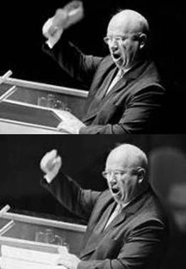

# Rewriting history

A library to rewrite Datomic history.

This library can rewrite the history of top level datoms.
A top level datom is a datom that is not referred by any other datom.
That is to say: no other datom is dependent on its existence.
This is important because the rewriting will cause the entity ID of the top level
datom and its children to change.

## Rationale

Regular Datomic excision does not remove retractions of non-existent entities 
that are part of the first transaction in the new history.
See [rationale_test.clj](test/no/nsd/rationale_test.clj) for a demonstration
of this problem.
This means that sensitive data can be left in the history database as retractions.

This library intends to solve this problem, and leave the user free to rewrite the history
as she/he likes.

## Features

* Graph / loop structures is supported.

* Regular references, not just component references, is supported.

* :db/idents will not be excised during history rewriting and is thus considered permanent.
